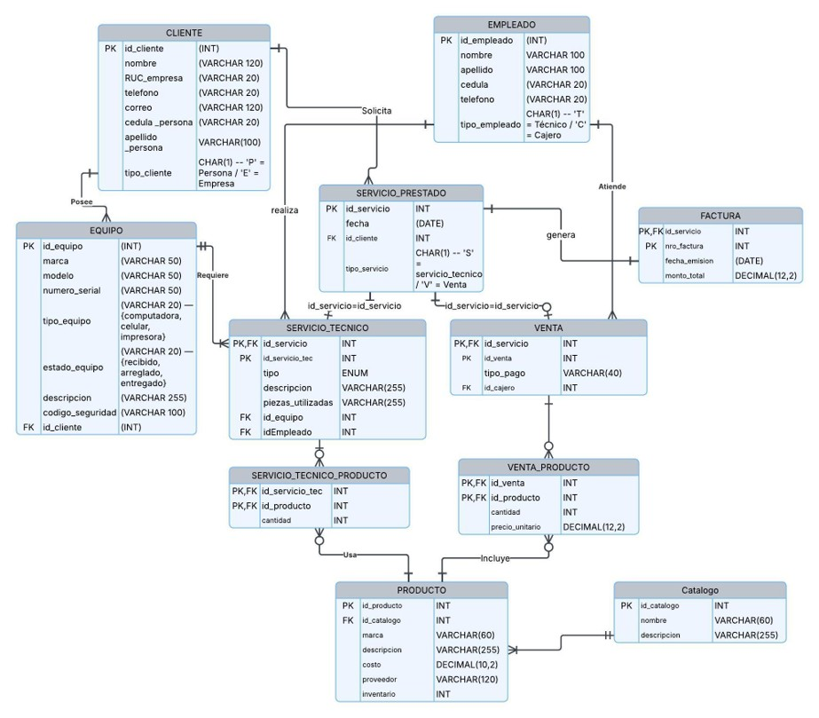
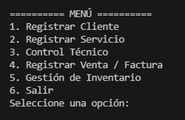
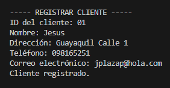
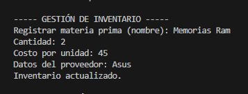
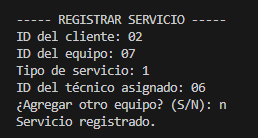

# TecniBase

Sistema de gestión para servicios técnicos desarrollado utilizando Python y MySQL.

## Descripción

TecniBase es una aplicación diseñada para apoyar la gestión operativa de un negocio de servicios técnicos, permitiendo administrar clientes, equipos, servicios, inventario, ventas y facturación desde una única plataforma.

El sistema integra una interfaz desarrollada en Python con una base de datos MySQL, implementando procedimientos almacenados, triggers, índices y mecanismos de control de acceso para garantizar la integridad y organización de la información.

## Funcionalidades

* Registro y gestión de clientes.
* Registro y seguimiento de servicios técnicos.
* Administración de equipos asociados a clientes.
* Gestión de inventario y productos.
* Registro de ventas y facturación.
* Generación de reportes operativos.
* Control automático de inventario mediante triggers.
* Gestión de usuarios basada en roles y permisos.

## Tecnologías Utilizadas

* Python
* MySQL
* SQL
* MySQL Workbench

## Modelo de Base de Datos

El sistema fue diseñado utilizando una base de datos relacional compuesta por entidades relacionadas con clientes, empleados, equipos, servicios técnicos, productos, inventario, ventas y facturación.



## Características de la Base de Datos

### Procedimientos Almacenados (Stored Procedures)

Se implementaron procedimientos almacenados para la gestión de:

* Clientes
* Empleados
* Equipos
* Servicios prestados
* Servicios técnicos
* Productos
* Catálogos
* Ventas
* Facturas

### Triggers

Se implementaron triggers para:

* Validar disponibilidad de stock antes de registrar ventas.
* Actualizar automáticamente el inventario después de cada venta.

### Índices

Se utilizaron índices para optimizar operaciones frecuentes de búsqueda y generación de reportes, incluyendo consultas relacionadas con:

* Clientes
* Facturas
* Servicios
* Empleados
* Productos

### Control de Acceso

El sistema contempla distintos perfiles de usuario con permisos específicos:

* Administrador
* Cajero
* Técnico
* Responsable de Inventario
* Usuario de Reportes

## Capturas del Sistema

### Menú Principal



### Registro de Clientes



### Gestión de Inventario



### Reporte de Servicios



## Estructura del Proyecto

```text
TecniBase/
│
├── README.md
├── .gitignore
│
├── src/
│   └── Código fuente Python
│
├── database/
│   └── Script SQL
│
└── docs/
    └── Capturas y documentación gráfica
```

## Instalación

1. Clonar el repositorio.
2. Crear la base de datos utilizando los scripts incluidos en la carpeta `database`.
3. Configurar las credenciales de conexión a MySQL en el código Python.
4. Ejecutar la aplicación desde la carpeta `src`.

## Aspectos Destacados

* Integración entre Python y MySQL para la gestión de información empresarial.
* Automatización de operaciones mediante Stored Procedures y Triggers.
* Diseño de una base de datos relacional con múltiples entidades y relaciones.
* Implementación de reportes para apoyo en la toma de decisiones.
* Gestión de permisos basada en roles de usuario.

## Autoría

Proyecto académico desarrollado en equipo.

Mi contribución principal se centró en el desarrollo de los procedimientos almacenados (Stored Procedures) de la base de datos y en la implementación de la integración entre Python y MySQL utilizada por la aplicación.

Este repositorio se mantiene con fines de portafolio y demostración técnica.
